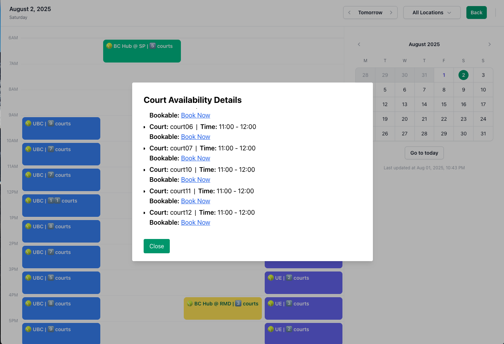
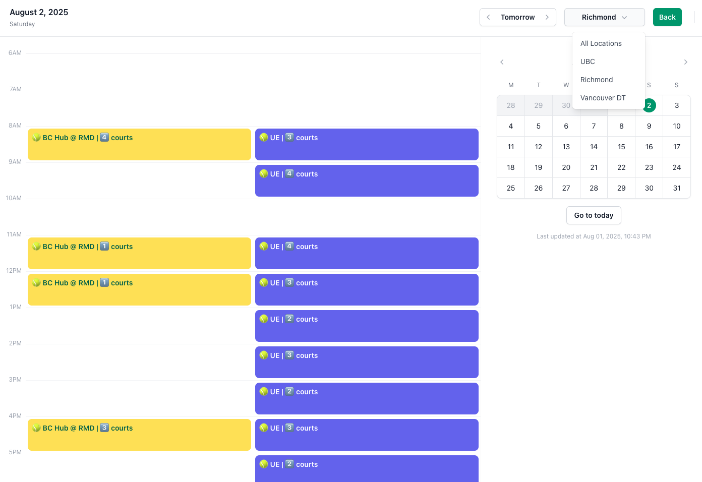
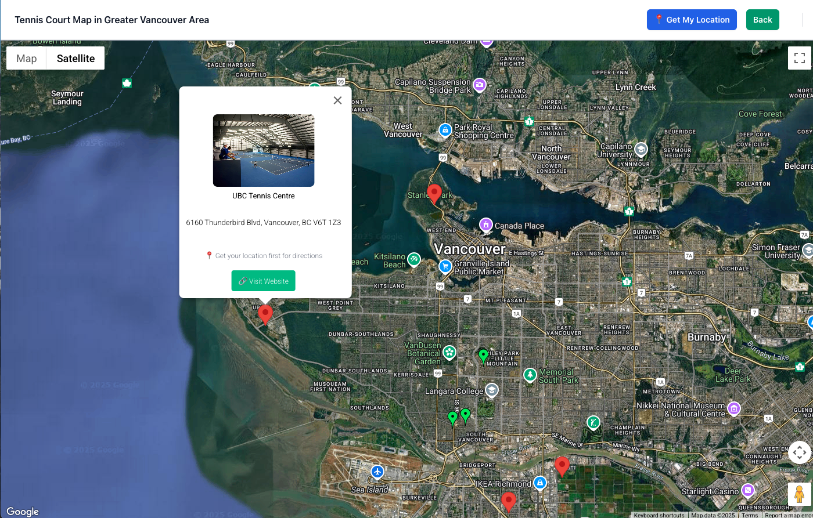
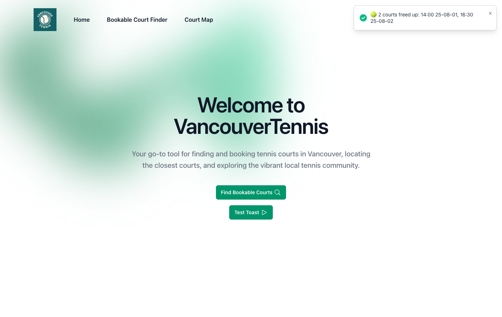

# Team 16 - CourtFinder

## App Summary

VancouverTennis is a comprehensive web platform designed for local tennis enthusiasts who want to book tennis courts without expensive club memberships. The application aggregates real-time availability data from multiple tennis facilities across Metro Vancouver through automated web scraping, presenting users with a unified calendar interface and interactive map to easily discover and book available courts.

## Instructions

- docker-compose down
- docker-compose up --build
- visit http://localhost:8080

## Demo

**Court Availability Feature**

You can see the court availability info of four clubs on one joint calendar. Dark color indicates these courts can be booked now. Light color means these courts can only be booked 24hrs in advance. Click a time slot you will see a more details list of available court of that club during that time. The link will redirect you to the exact booking page.

**Courts Filter**

You can filter the courts by its location so that you can choose to only see the courts in your desired area.

**Court Map**

You can see both the public and private tennis courts on a map. You can use your own location to get the route and estimated time to your target court.

**Freed Court Detector**

You will recieve a notification toggle on the home page indicating some courts are freed due to cancellation.

## Standard Goals

All standard goals have been completed:

**Minimum Requirements:**

- Interactive and dynamic PC UI for home page - **Completed**
- Robust web scrapers for targeted court booking websites - **Completed** (Enhanced beyond requirements - all scrapers now make direct API calls and parse JSON)
- Backend database supporting basic court availability operations - **Completed** (Full functionality with concurrent request handling and stale data management)

**Standard Requirements:**

- Automated scraping and data updating pipeline - **Completed** (Smart scheduling with orchestrator system)
- Interactive and dynamic mobile UI for home page - **Completed** (Both PC and mobile views implemented and improved based on user feedback)
- Google Maps integration with nearby tennis courts and photos - **Completed**

## Stretch Goals

The following stretch goals will **not** be implemented by M5:

- Multi-page tennis lessons directory with filtering - **Dropped** (Scope too large for remaining timeline)
- Multi-page tennis events directory with filtering - **Dropped** (No stable data source; Scope too large for remaining timeline)
- Google OAuth user authentication and profiles - **Dropped** (No real user need; Scope too large for remaining timeline)

## Non-Trivial Elements

| Element                                                          | Stage of Completion |
| ---------------------------------------------------------------- | ------------------- |
| Web Scraping Orchestrator with Smart Scheduling                  | **Completed**       |
| UBC Tennis Centre Advanced API Scraper                           | **Completed**       |
| MongoDB Integration with Synthetic Primary Keys                  | **Completed**       |
| Real-time Data Caching and Freshness Validation                  | **Completed**       |
| Concurrent Request Handling and Rate Limiting                    | **Completed**       |
| Tiered Data Retrieval Strategy                                   | **Completed**       |
| Google Maps API Integration with Interactive Court Visualization | **Completed**       |
| Comprehensive API Test Suite                                     | **Completed**       |
| Unified Timezone Handling (PST)                                  | **Completed**       |

## M5 Highlights

**Major Changes Since Milestone 4:**

**Francis Update:** WebApp deployment & UI adjustments

- AWS VSP Deployment: Deployed the docker image through the AWS LightSail service.
- Domain Configuration: Purchased domain [VancouverTennis.org](https://VancouverTennis.org) and connected it with our AWS instance.
- UI Adjustment: Made the data update time dynamic, map style changed, and map mark style changed.

**Lewis Update:** New features - user location functionality & route planning capabilities

- Users can now click "Get My Location" (available on both desktop and mobile views) to display their current position as a blue marker on the map, with the map automatically centering on their location.
- The route planning feature allows users to click "Get Directions" on any court pin to calculate and display a driving route from their location to the selected court, complete with distance and time estimates. The route is visually represented as a polyline on the map, and users can clear the route using the "Clear Route" button.

**Charlie Update**: New feature - toast notifications for freed up courts

- Implemented backend logic using snapshot comparison - system stores old data snapshots and compares with new parsed data to detect when courts become available
- Built API endpoints to serve freed court data to frontend with proper caching mechanism
- Developed frontend toast notification component that automatically checks for freed courts when users visit landing page
- Created comprehensive test cases covering snapshot comparison logic, API endpoints, and frontend notification behavior
- Designed filtering system that excludes non-immediately available courts and only notifies users of genuinely freed booking opportunities

**Bug List Location:**
Bug tracking is maintained in GitHub Issues with P0-P5 priority labeling system. All of these bug issues are closed.
